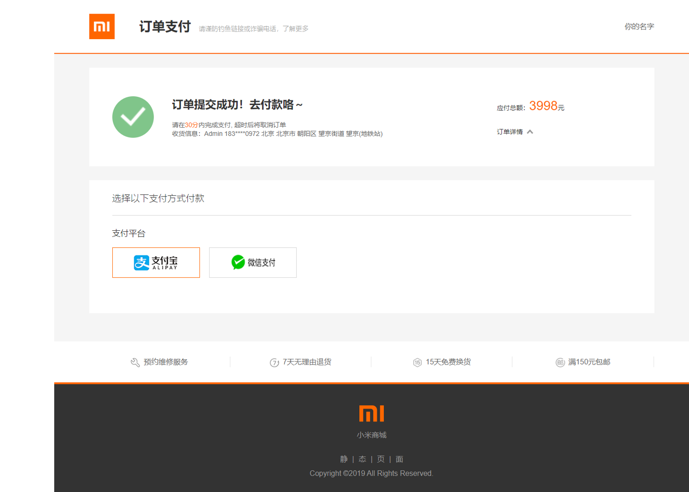

## Mi-Mock-Online-Shopping 

**Learn VUE, VUEX, VUE-Router by building a mock-online-shopping store**

#### Get started

```
1. git clone 'repo'
2. npm i
3. npm run serve
```


- All Products


- Production Detail


- My Order


- Payment Comfirm


- Pay it

