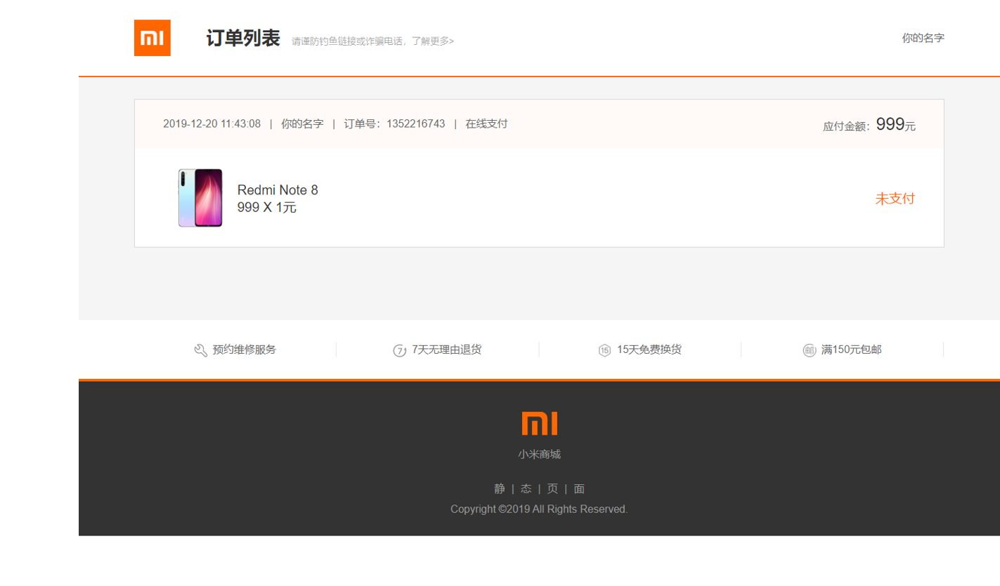
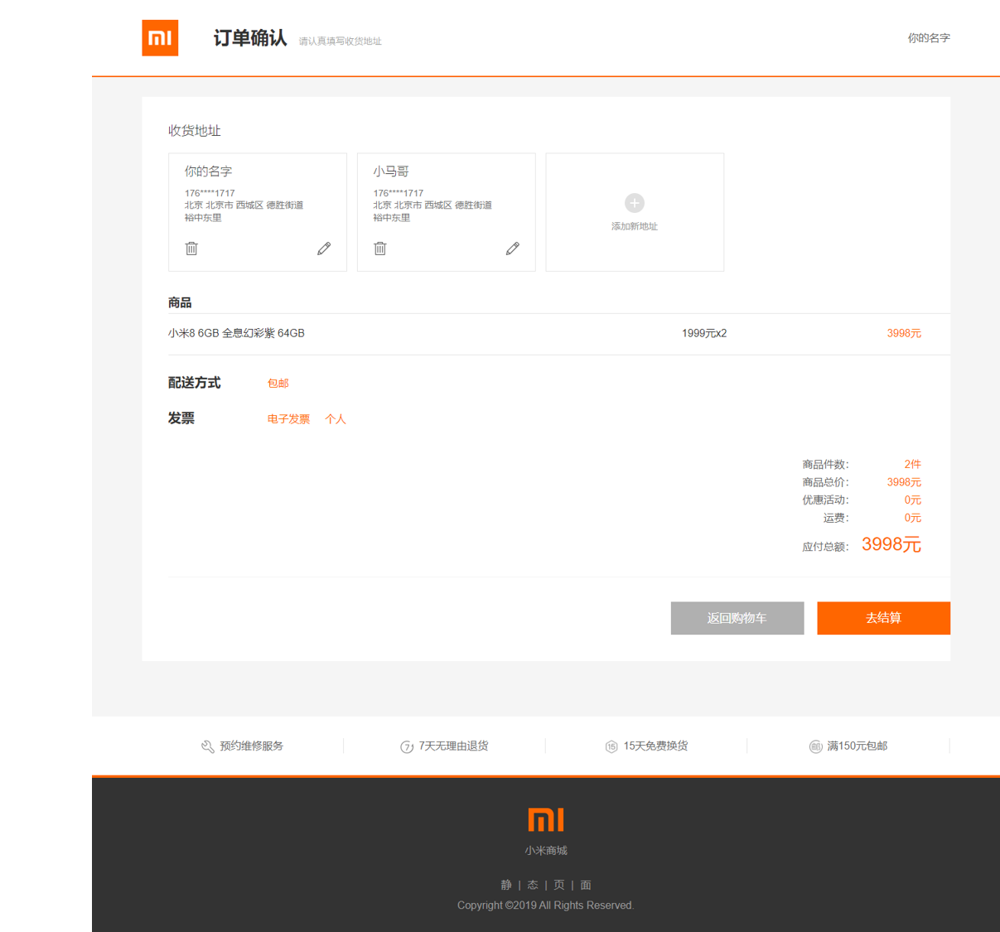

## Mi-Mock-Online-Shopping 

**Learn VUE, VUEX, VUE-Router by building a mock-online-shopping store**

#### Get started

```
1. git clone 'this repo'
2. npm i
3. npm run serve
```


#### All Products
<div style="text-align: center">
     
</div>

#### Production Detail
<div style="text-align: center">
     
</div>

#### My Order
<div style="text-align: center">
     
</div>

#### Payment Comfirm
<div style="text-align: center">
     
</div>

#### Pay it
<div style="text-align: center">
     
</div>
